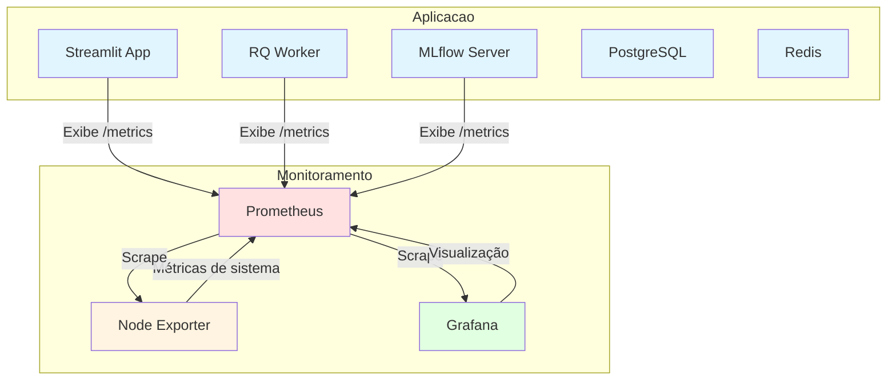
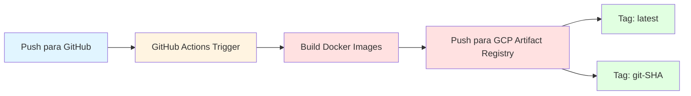

# Plano: Observabilidade com Grafana/Prometheus e CI/CD com GitHub

## Resumo

Este plano detalha a implementação de:
1. **Observabilidade**: Prometheus + Grafana para monitoramento de métricas do sistema e do aplicativo
2. **CI/CD**: GitHub Actions para build e push de imagem Docker (apenas app) para Google Cloud Artifact Registry

> **Nota**: Este é um projeto de exemplo educacional para demonstrar observabilidade e CI/CD.

## Arquitetura Proposta

### Diagrama de Observabilidade



### Diagrama de CI/CD



## Parte 1: Observabilidade

### 1.1 Infraestrutura Prometheus

**Arquivos a criar/modificar:**
- `prometheus/prometheus.yml` - Configuração do Prometheus
- `docker-compose.yml` - Adicionar serviço Prometheus

**Configuração do Prometheus:**
- Scrape interval: 15s
- Scrape targets:
  - Streamlit app: `streamlit:8001/metrics`
  - RQ Worker: `rq_worker:8002/metrics`
  - MLflow: `mlflow:5000/metrics`
  - Node Exporter: `node-exporter:9100/metrics`

**Serviço Docker Compose:**
```yaml
prometheus:
  image: prom/prometheus:latest
  container_name: prometheus
  ports:
    - "9090:9090"
  volumes:
    - ./prometheus/prometheus.yml:/etc/prometheus/prometheus.yml
    - prometheus-data:/prometheus
  command:
    - '--config.file=/etc/prometheus/prometheus.yml'
    - '--storage.tsdb.path=/prometheus'
  networks:
    - ml_net
```

### 1.2 Infraestrutura Grafana

**Arquivos a criar/modificar:**
- `docker-compose.yml` - Adicionar serviço Grafana
- `grafana/provisioning/datasources/prometheus.yml` - Datasource config

**Serviço Docker Compose:**
```yaml
grafana:
  image: grafana/grafana:latest
  container_name: grafana
  ports:
    - "3030:3000"
  volumes:
    - grafana-data:/var/lib/grafana
    - ./grafana/provisioning:/etc/grafana/provisioning
  environment:
    - GF_SECURITY_ADMIN_PASSWORD=admin
    - GF_USERS_ALLOW_SIGN_UP=false
  depends_on:
    - prometheus
  networks:
    - ml_net
```

> **Nota**: Porta 3030 usada para evitar conflito com BentoML (porta 3000)

### 1.3 Node Exporter (Métricas do Sistema)

**Arquivos a criar/modificar:**
- `docker-compose.yml` - Adicionar serviço Node Exporter

**Serviço Docker Compose:**
```yaml
node-exporter:
  image: prom/node-exporter:latest
  container_name: node-exporter
  ports:
    - "9100:9100"
  command:
    - '--path.procfs=/host/proc'
    - '--path.sysfs=/host/sys'
    - '--collector.filesystem.mount-points-exclude=^/(sys|proc|dev|host|etc)($$|/)'
  volumes:
    - /proc:/host/proc:ro
    - /sys:/host/sys:ro
    - /:/rootfs:ro
  networks:
    - ml_net
```

### 1.4 Métricas do Aplicativo

**Arquivos a criar:**
- `src/metrics.py` - Módulo central de métricas
- `requirements.txt` - Adicionar `prometheus_client`

**Métricas a implementar:**

| Métrica | Tipo | Descrição |
|---------|------|-----------|
| `transcription_requests_total` | Counter | Total de transcrições solicitadas |
| `transcription_completed_total` | Counter | Total de transcrições completadas |
| `transcription_failed_total` | Counter | Total de transcrições falhadas |
| `transcription_duration_seconds` | Histogram | Tempo de processamento de transcrição |
| `queue_size` | Gauge | Tamanho atual da fila RQ |
| `active_jobs` | Gauge | Número de jobs ativos no worker |
| `upload_requests_total` | Counter | Total de uploads para R2 |
| `upload_bytes_total` | Counter | Total de bytes enviados para R2 |

**Integração no app.py:**
- Iniciar servidor de métricas em thread separada (porta 8001)
- Incrementar contador ao receber upload
- Atualizar gauge de tamanho da fila periodicamente

**Integração no worker.py:**
- Iniciar servidor de métricas em thread separada (porta 8002)
- Incrementar contador ao iniciar job
- Registrar tempo de processamento
- Incrementar contador de sucesso/erro ao finalizar

### 1.5 Dashboards Grafana

**Dashboards a criar:**

1. **Dashboard do Sistema** (`dashboards/system.json`)
   - CPU usage (%)
   - Memory usage (%)
   - Disk I/O
   - Network I/O

2. **Dashboard do Aplicativo** (`dashboards/application.json`)
   - Transcrições por minuto
   - Taxa de erro (%)
   - Tempo médio de processamento
   - Tamanho da fila RQ
   - Jobs ativos

3. **Dashboard Combinado** (`dashboards/overview.json`)
   - Visão geral de todas as métricas
   - Alertas visuais para anomalias

## Parte 2: CI/CD com GitHub Actions

### 2.1 Estrutura do Workflow

**Arquivo:** `.github/workflows/docker-build-push.yml`

**Triggers:**
- Push para branch `main`
- Tags no formato `v*.*.*`
- Pull requests (opcional)

### 2.2 Autenticação Google Cloud Artifact Registry

**Secrets necessários no GitHub:**

| Secret | Descrição | Exemplo |
|--------|-----------|---------|
| `GCP_SA_KEY` | Service Account key (base64) | `eyJhbGciOi...` |
| `PROJECT_ID` | ID do projeto GCP | `my-mlops-project` |
| `REGION` | Região do registry | `us-central1` |
| `REPOSITORY` | Nome do repositório | `mlops-repo` |

**Setup do Service Account no GCP:**
1. Criar Service Account: `Artifact Registry Writer`
2. Baixar chave JSON
3. Converter para base64: `cat key.json | base64 -w 0`
4. Adicionar como secret no GitHub

### 2.3 Build e Push de Imagens

**Imagem a buildar:**

1. `app` (usando `Dockerfile.app`)
   - Registry: `REGION-docker.pkg.dev/PROJECT_ID/REPOSITORY/app`
   - Tags: `latest`, `git-SHA`

**Workflow steps:**
1. Checkout do código
2. Setup de autenticação GCP
3. Login no Artifact Registry
4. Build da imagem app
5. Push da imagem app

### 2.4 Exemplo de Workflow

```yaml
name: Build and Push Docker Images

on:
  push:
    branches: [main]
    tags: ['v*']
  pull_request:
    branches: [main]

jobs:
  build-and-push:
    runs-on: ubuntu-latest
    steps:
      - name: Checkout
        uses: actions/checkout@v4

      - name: Authenticate to GCP
        id: auth
        uses: google-github-actions/auth@v2
        with:
          credentials_json: ${{ secrets.GCP_SA_KEY }}

      - name: Login to Artifact Registry
        uses: docker/login-action@v3
        with:
          registry: ${{ secrets.REGION }}-docker.pkg.dev
          username: _json_key
          password: ${{ secrets.GCP_SA_KEY }}

      - name: Build App image
        run: |
          docker build -f Dockerfile.app -t ${{ secrets.REGION }}-docker.pkg.dev/${{ secrets.PROJECT_ID }}/${{ secrets.REPOSITORY }}/app:latest .
          docker tag ${{ secrets.REGION }}-docker.pkg.dev/${{ secrets.PROJECT_ID }}/${{ secrets.REPOSITORY }}/app:latest ${{ secrets.REGION }}-docker.pkg.dev/${{ secrets.PROJECT_ID }}/${{ secrets.REPOSITORY }}/app:${{ github.sha }}

      - name: Push App image
        run: |
          docker push ${{ secrets.REGION }}-docker.pkg.dev/${{ secrets.PROJECT_ID }}/${{ secrets.REPOSITORY }}/app:latest
          docker push ${{ secrets.REGION }}-docker.pkg.dev/${{ secrets.PROJECT_ID }}/${{ secrets.REPOSITORY }}/app:${{ github.sha }}
```

## Parte 3: Documentação

### 3.1 Acessando Grafana

- URL: `http://localhost:3030`
- Usuário: `admin`
- Senha: `admin` (alterar no primeiro acesso)

### 3.2 Configurando Secrets do GitHub

1. Ir para Settings → Secrets and variables → Actions
2. Adicionar secrets:
   - `GCP_SA_KEY`: Service account key em base64
   - `PROJECT_ID`: ID do projeto GCP
   - `REGION`: Região do Artifact Registry
   - `REPOSITORY`: Nome do repositório

### 3.3 Adicionando Novos Dashboards

1. Acessar Grafana
2. Ir para Dashboards → Import
3. Colar JSON do dashboard ou usar ID do Grafana.com

## Checklist de Implementação

### Observabilidade
- [ ] Criar diretório `prometheus/`
- [ ] Criar `prometheus/prometheus.yml`
- [ ] Adicionar Prometheus ao `docker-compose.yml`
- [ ] Criar diretório `grafana/provisioning/datasources/`
- [ ] Criar `grafana/provisioning/datasources/prometheus.yml`
- [ ] Adicionar Grafana ao `docker-compose.yml` (porta 3030)
- [ ] Adicionar Node Exporter ao `docker-compose.yml`
- [ ] Adicionar `prometheus_client` ao `requirements.txt`
- [ ] Criar `src/metrics.py`
- [ ] Integrar métricas no `app.py`
- [ ] Integrar métricas no `worker.py`
- [ ] Criar dashboards no Grafana

### CI/CD
- [ ] Criar diretório `.github/workflows/`
- [ ] Criar `.github/workflows/docker-build-push.yml` (apenas app)
- [ ] Configurar Service Account no GCP
- [ ] Adicionar secrets ao GitHub
- [ ] Testar workflow manualmente
- [ ] Atualizar `docker-compose.yml` para usar imagem do registry (app)

### Documentação
- [ ] Criar `docs/observabilidade.md`
- [ ] Criar `docs/cicd.md`
- [ ] Atualizar `README.md`
